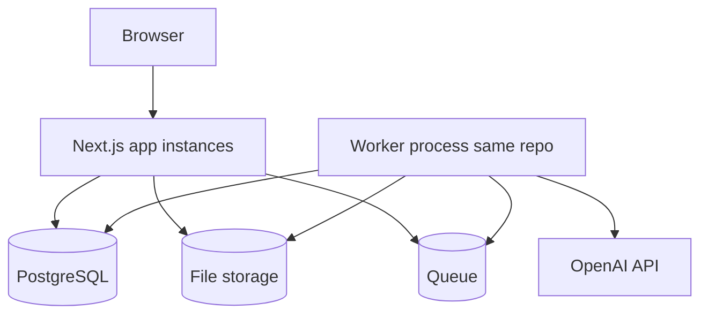
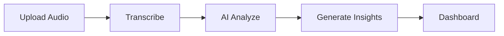

# Call Analyser — Project Plan

**Event:** [CP Prompt-X: The AI Vibe Coding Hackathon](https://gamma.app/docs/CP-Prompt-X-The-AI-Vibe-Coding-Hackathon-fbvuafc2us3jw5o?mode=doc) (Commerce Pundit internal hackathon)  
**Product:** AI-powered **Call Intelligence Platform** — analyze **sales call recordings** and produce structured, actionable insights (agent performance, sentiment, conversation quality).

This plan merges the **official brief** (including screenshot), your **SaaS / permissions / resilience** requirements, and **`rules.md`** architecture.

---

## 1. Vision

Build a **multi-tenant SaaS** where **companies register**, **admins manage users**, and **users sign in** to run the full pipeline — **upload audio → transcribe → AI analyze → insights → dashboards** — with **module- and operation-level permissions** (CRUD) so each role only sees and performs allowed actions.

**Tech baseline:** **Next.js (App Router)**, **Prisma**, **PostgreSQL** (`DATABASE_URL` and credentials in **`.env`**), **OpenAI** for transcription/analysis via **`OPENAI_API_KEY`** in **`.env`** (loaded only through `lib/env`, never exposed to the client). **UI:** **Tailwind CSS** + **[shadcn/ui](https://ui.shadcn.com/)** (Radix-based primitives, project-owned components under `components/ui`). **Theming:** **light** and **dark** modes with user-selectable preference stored in a **cookie** (server-readable) so refresh does not flash or switch themes during load (see §2.5).

**Official problem framing (sales orgs):**

| Theme | Question the product helps answer |
|--------|-----------------------------------|
| **Discovery quality** | Did the rep ask the right discovery questions? |
| **Talk time balance** | Customer vs agent speaking time — listening vs dominating? |
| **Customer sentiment** | Satisfied, frustrated, or disengaged? |
| **Follow-up clarity** | Commitments, next steps, action items agreed? |

**What teams are given:** Sample call recordings and **questionnaires** simulating real sales conversations — use as foundation for the prototype.

---

## 2. Platform & architecture decision

### 2.1 Chosen approach

| Decision | Choice |
|----------|--------|
| **Application platform** | **Single Next.js (App Router) project** — one deployable **web application** (UI + Route Handlers + Server Actions). |
| **API style** | **No separate standalone API service** (e.g. Nest/Fastify) for **v1 / hackathon**. HTTP surface stays inside Next.js. |
| **Heavy / long work** | **Queue + background worker process(es)** in the **same monorepo**, sharing **Prisma**, `services/`, and `lib/`. |
| **Database** | **PostgreSQL** (single source of truth for tenants, calls, jobs, analysis). |
| **UI** | **Tailwind CSS** + **shadcn/ui**; **light / dark** theme persisted in **cookies** with **no theme flash** on refresh (see §2.5). |

**Why not a split “Next + API” from day one:** Throughput and latency are dominated by **PostgreSQL**, **OpenAI/transcription**, **file I/O**, and **job concurrency** — not by colocating UI and server logic in Next.js. A second HTTP service adds deployment, auth between services, duplicated boundaries, and slower iteration without fixing those bottlenecks. Scale the **job workers** and **DB**, not the API count, first.

**When to revisit a separate API:** Multiple first-class clients (native apps, public partner APIs), strict org split between web and API teams, or proven need for independent HTTP scaling — not assumed for this prototype.

### 2.2 Runtime topology (performance & scalability)

- **Web tier:** Stateless Next.js processes (scale horizontally). Upload completes quickly; **enqueue** work only.
- **Worker tier:** One or more **Node worker** processes (e.g. `worker/index.ts` or `npm run worker`) that **consume jobs** from the queue, run transcription + batched analysis, write results and logs. **Never** run long OpenAI/transcription work inside the HTTP request lifecycle.
- **Queue (default recommendation):** **BullMQ + Redis** — mature retries, visibility, concurrency control. **Alternative:** **pg-boss** (jobs in Postgres) if the team wants to **defer Redis** and accept slightly different ops tradeoffs.
- **Scaling:** Add **worker replicas** and tune **queue concurrency**; add **DB indexes** and connection pooling; use **object storage** (S3-compatible) for audio in production.

### 2.3 Repository layout (indicative)

- `src/` — Next.js app per **`rules.md`** (`app/`, `modules/`, `services/`, `lib/prisma`, …).
- `worker/` (or `src/worker/`) — queue consumer entrypoint; imports shared `services/analysis`, `services/transcription`, `lib/prisma`, `lib/logger`.
- `prisma/` — schema and migrations (shared by Next and worker).
- `package.json` scripts: `dev`, `build`, `start`, **`worker`** (and `dev:worker` for local).

### 2.4 Alignment with rubric

- **Architecture & Structure (10 pts):** One coherent monorepo with clear **module** boundaries and a **dedicated worker** demonstrates real-world applicability without unnecessary microservices.

### 2.5 UI stack & theming (chosen libraries)

| Layer | Choice | Notes |
|--------|--------|--------|
| **Styling** | **Tailwind CSS** | Utility-first layout/spacing/typography; use **CSS variables** for theme tokens (aligned with shadcn’s default pattern). |
| **Components** | **shadcn/ui** | Install via CLI into the repo; components live in **`src/components/ui/`** (buttons, dialogs, forms, tables, dropdowns, tabs, etc.). Compose feature UIs from these primitives + Tailwind. |
| **Accessibility** | Radix UI (via shadcn) | Keyboard and screen-reader behaviour comes with primitives; keep labels on custom widgets (e.g. audio player controls). |

**Dark & light theme (required)**

- **Modes:** **Light** and **dark** must both be **fully supported** across layouts, dashboards, auth screens, and the individual call view (including charts, tables, and transcript/player chrome).
- **User control:** A visible **theme control** (e.g. toggle or **light / dark / system** selector) in the **app shell** (header or user/settings area). Switching must apply immediately without full page reload.
- **Persistence (cookie, not localStorage-only):** Store the choice in an **HTTP cookie** (e.g. name like `theme`, values `light` | `dark` | `system`, `Path=/`, appropriate `Max-Age`, `SameSite=Lax`). The cookie is the **source of truth** so the **server** can read it on every request. Avoid relying on **`localStorage` alone** for theme — it is invisible to the server and causes a wrong first paint after refresh.
- **No flash / no “juggle” on load or refresh:** After the user picks dark or light, a **full refresh** must **not** briefly show the wrong theme or flicker while JS loads. Requirements:
  - **Server-aware first paint:** Root `layout.tsx` (Server Component) reads **`cookies().get('theme')`** (or middleware-forwarded value) and applies the correct **`class` on `<html>`** (e.g. `dark` for Tailwind) **before** hydration, **or** passes the resolved default into **`ThemeProvider`** so it matches the cookie on first render.
  - **`suppressHydrationWarning`** on `<html>` where **`next-themes`** requires it to avoid hydration mismatch warnings.
  - On toggle: update the cookie (e.g. **Route Handler** or **Server Action** with `Set-Cookie`, or client setting a cookie that the server also understands) **and** client theme state so the next navigation/refresh stays consistent.
- **First visit:** If no cookie, use **`prefers-color-scheme`** for “system” or a documented default (e.g. light); optionally set the cookie when the user makes their first explicit choice.
- **Implementation pattern (recommended):** **`next-themes`** with **`ThemeProvider`**, Tailwind **`darkMode: 'class'`**, cookie sync as above — verify behaviour with **hard refresh** and **cold load** in both themes.

**Code organisation:** Shared layout chrome (sidebar, top bar, theme toggle) in `src/components/` or `src/modules/shell/`; feature pages use the same tokens so **UI/UX Design (10 pts)** stays consistent.

---

## 3. End-to-end application workflow (required)

Each step builds on the previous; prioritize a **clean, modular** architecture for this flow:

| Step | Responsibility |
|------|----------------|
| **Upload Audio** | Authenticated upload, validation, storage; **progress UI** (see §8.1). |
| **Transcribe** | Raw audio → accurate, readable **transcript** (batch-friendly; resilient to partial failures). |
| **AI Analyze** | Conversation quality, sentiment, scoring, questionnaire coverage, keywords, action items, observations. |
| **Generate Insights** | Persist normalised results per call + aggregates for org-scoped reporting. |
| **Dashboard** | Main org dashboard + per-call detail (see §4–5). |

---

## 4. Required features: Main Dashboard (org-level)

High-level overview of **all analyzed calls** for managers (respecting permissions and `organisationId`).

| Widget | Requirement |
|--------|----------------|
| **Total Calls Processed** | Running count of recordings analyzed. |
| **Sentiment Split** | Breakdown: **Positive / Negative / Neutral** across all calls. |
| **Average Call Score** | Mean quality score **0–10** across processed calls. |
| **Avg. Call Duration** | Average length of calls (engagement benchmark). |
| **Top Keywords** | Most frequent topics across the **entire** call library. |
| **Action Items Total** | Aggregate count of follow-up tasks/commitments across all calls. |

**Implementation note:** Back these with aggregated queries (or materialised summaries) scoped by tenant; document how partial jobs affect counts (e.g. include only `completed` or define explicit rules).

---

## 5. Required features: Individual Call Dashboard

Dedicated page per recording with granular detail.

### 5.1 Core blocks

| Block | Requirement |
|--------|-------------|
| **Call Summary** | AI summary: purpose, main topics, outcome. |
| **Call Sentiment** | **Positive, Neutral, or Negative** (tone/language). |
| **Recording player + transcript** | Play **original audio** with **synchronised transcript** (scroll/highlight strategy as feasible for prototype). |
| **Talk time analysis** | Estimated **Agent %** vs **Customer %** (listening vs over-talking). Example: 60% agent / 40% customer. |
| **Overall call score** | Single numeric **0–10** from sentiment, agent behaviour, professional communication. |

### 5.2 Agent sentiment & performance scoring

Score the sales rep **1–10** on each dimension:

1. **Communication Clarity** — clear, concise, easy to understand.  
2. **Politeness** — respectful, empathetic, professional.  
3. **Business Knowledge** — product/industry strength.  
4. **Problem Handling** — objections handled calmly, logically, constructively.  
5. **Listening Ability** — adequate space for the customer to speak.

Store as structured fields (or JSON with schema validation) for charts/tables.

### 5.3 Business questionnaire & keyword analysis

- **Questionnaire coverage:** Predefined discovery topics (e.g. Budget, Competitor, Scope, Cabinet style, Full remodel). For each: **Asked?** — **Yes / No** (and optionally “covered count” if brief implies counting). Align prompts/schema with **provided sample questionnaire** files in the repo when available.
- **Top keywords discussed:** Extract and display frequent topics (tags/pills), e.g. Budget, Installation, Warranty, Delivery — **org- or library-level** frequency on main dashboard; **per-call** top terms on the call page.

### 5.4 Follow-up actions & AI-generated notes

- **Follow-up action items:** Structured list of commitments/next steps (e.g. “Send updated quote”, “Schedule consultation”).
- **Positive observations:** Bullets — what went well.
- **Negative observations:** Bullets — gaps, risks, coaching opportunities.

---

## 6. Hackathon objectives (product capabilities)

The prototype must demonstrate:

1. **Transcribe** recordings → accurate, analysis-ready transcripts.  
2. **Analyze conversation quality** — flow, pacing, structure, engagement.  
3. **Evaluate agent performance** — multi-dimensional scoring.  
4. **Identify sentiment & patterns** — tone, shifts, behaviour.  
5. **Extract action items** — commitments and follow-ups from the conversation.

---

## 7. Vibe Coding methodology (submission requirement)

Solutions must reflect **Vibe Coding**: AI-assisted tools, automation, rapid iteration.

| Principle | Practice |
|-----------|----------|
| **AI-first development** | Heavy use of Copilot, Cursor, or similar **throughout** the build. |
| **Rapid prototyping** | Fast loops: build → test → refine with AI feedback. |
| **Minimal manual coding** | Prefer AI-generated flows where sensible; document tradeoffs in README. |
| **Prompt log** | Maintain a **Prompt Log** document of key prompts — central to judging (see §13). |

---

## 8. SaaS, permissions, pipeline resilience (your requirements)

### 8.1 Upload

- **Progress bar** during upload (XHR/fetch `onprogress` or equivalent).
- After upload completes, **enqueue** analysis (transcribe → analyse → persist insights) — see **§2.2** (worker + queue).

### 8.2 Tenancy & identity

- **Organisation (company):** root tenant; company self-registration + first admin user.  
- **User management:** CRUD inside org; **roles** with **per-module, per-operation** permissions (create/read/update/delete as applicable).  
- **Enforcement:** server-side on every API/Server Action; UI mirrors permissions; all queries scoped by **`organisationId`**.

### 8.3 Processing (batch-wise, non-breaking, retries, logs)

- **Batches:** split transcription/analysis work into batches (token limits, cost, recovery).  
- **Isolation:** failure in **one batch** must **not** kill the entire job — record failure, continue other batches; surface **partial** results where possible.  
- **Retries:** **up to 3 attempts** per failed batch/operation with backoff + jitter (constants in `constants/`).  
- **Logging:** **Server log files** (e.g. under `logs/…`, rotated by day or job) with structured entries: timestamp, `orgId`, `userId`, `jobId`, `batchId`, level, message, sanitised errors.  
- **Regression safety:** automated tests for permission matrix, retry helper, and one happy-path + one partial-failure integration path; manual checklist before demo.

---

## 9. Modular application structure

Align with **`rules.md`**: `src/modules/<feature>/`, shared `constants/`, `utils/`, `services/`, `context/`, `lib/prisma`. **Shared UI:** **`src/components/ui/`** (shadcn primitives only), **`src/components/`** for cross-feature composites; use **Tailwind** + **theme tokens** for all new styles.

| Module | Responsibility |
|--------|------------------|
| `auth` | Login, logout, session, password reset |
| `organisations` | Registration, org profile, tenant context |
| `users` | User CRUD, role assignment |
| `permissions` | Matrix, guards for CRUD per module |
| `files` | Upload, storage abstraction, metadata |
| `transcription` | Audio → transcript (OpenAI or compatible API) |
| `analysis` | Batches, OpenAI analysis, retries, job state |
| `calls` / `reports` | Call list, main dashboard aggregates, individual call UI data |
| `audit` / `jobs` | Job lifecycle, correlation IDs |

Separate **services**: e.g. `services/storage`, `services/transcription`, `services/analysis` orchestrating batches and logging — **invoked from Route Handlers / Server Actions (enqueue)** and from the **worker** (execute).

---

## 10. Data model (aligned with UI + SaaS)

Indicative entities (names adjustable in Prisma):

- `Organisation`, `User`, `Role`, permission links (module + operation).
- `Call` / `Recording` — `organisationId`, duration, audio storage key, status, uploadedBy.
- `Transcript` — text, optional segments with timestamps for **player sync**.
- `AnalysisJob`, `AnalysisBatch` — status, retries, errors.
- **Structured analysis** (table or JSON with Zod validation):
  - `overallScore` (0–10), `callSentiment` (enum).
  - `agentTalkPct`, `customerTalkPct`.
  - Five **1–10** agent dimension scores.
  - `questionnaireCoverage[]` — topic id, asked boolean (and optional count).
  - `keywords` (per call + support aggregates for main dashboard).
  - `actionItems[]`, `positiveObservations[]`, `negativeObservations[]`, `summary` text.

**Indexes:** `(organisationId, …)` everywhere; status + `createdAt` for jobs.

---

## 11. Background processing (operational contract)

This section implements **§2.2** in product terms.

| Concern | Rule |
|---------|------|
| **Enqueue from web** | After upload + DB record, push **job id** to queue; respond quickly to the client. |
| **Execute in worker** | Transcription and batched OpenAI calls run **only** in worker(s); idempotent handlers by `jobId` / `batchId`. |
| **MVP fallback** | For local demo only: document if a **single-process** dev mode polls DB (no Redis) — production path should use **queue + worker** as above. |
| **Dedupe & retries** | Align with **§8.3** (3 retries, partial job continuation). |

---

## 12. Configuration & secrets

| Variable (examples) | Purpose |
|---------------------|---------|
| `DATABASE_URL` | PostgreSQL |
| `OPENAI_API_KEY` | Transcription + analysis (server-only) |
| `REDIS_URL` | BullMQ (if using Redis-backed queue) |
| Session / auth secret | e.g. `NEXTAUTH_SECRET` or equivalent |
| `FILE_STORAGE_*` or local path | Audio files |
| `LOG_DIR`, `LOG_LEVEL` | File logging |

Validate in **`lib/env`** at startup.

---

## 13. Evaluation criteria & deliverables (official)

### 13.1 Scoring (100 points total)

| Category | Points |
|----------|--------|
| **Prompt Quality** | **20** |
| Problem Understanding | 15 |
| AI Utilization Strategy | 15 |
| Code Quality (Generated) | 15 |
| UI/UX Design | 10 |
| Architecture & Structure | 10 |
| Real-World Applicability | 10 |
| Demo & Explanation | 5 |

**Insight:** **Prompt Quality** is the highest weight — document prompts, iteration, and context in the **Prompt Log**.

### 13.2 Deliverables checklist (all required)

1. **Working prototype** — full workflow: upload → transcribe → analyze → dashboards.  
2. **BitBucket repository** — clean, accessible; judges review structure and code.  
3. **Prompt Log document** — key prompts and AI interaction strategy.  
4. **Demo video (5–7 min)** — walkthrough, features, vibe-coding approach, real analysis examples.  
5. **README** — architecture, **code structure**, step-by-step setup.  
6. *(Complete submission = all of the above by deadline.)*

---

## 14. Phased delivery (suggested)

| Phase | Outcome |
|-------|---------|
| **P0** | Scaffold, **Tailwind** + **shadcn/ui** init, **`next-themes`** + **cookie-backed** theme + **no flash** on refresh (§2.5), Prisma schema (tenant + call + analysis shapes), auth, org registration, user management, permission guards |
| **P1** | Queue + **worker** skeleton, upload + progress, storage, enqueue transcription job, transcript persistence |
| **P2** | AI analysis pipeline in worker (batches, retries, logs), persist structured insights |
| **P3** | Main dashboard widgets + individual call page (player + transcript, scores, questionnaire, keywords, notes) |
| **P4** | Polish UI/UX (contrast/readability in **both** themes), demo path, README + Prompt Log, video script |

---

## 15. Success criteria (merged checklist)

**Hackathon / product**

- [x] **Upload audio** with **progress**; pipeline runs **after** upload.  
- [x] **Transcribe** → **AI analyze** → **insights** → **main + individual** dashboards. *(Transcription is live via Whisper; analysis output is still structured stub logic.)*  
- [x] Main dashboard: **all six** widgets (§4).  
- [x] Individual call: summary, sentiment, **player + transcript timestamp seek**, talk-time split, overall score, **five** dimension scores, questionnaire table, keywords, action items, positive/negative notes (§5).  
- [x] Addresses **discovery, talk-time, sentiment, follow-up** themes (§1).  
- [x] **UI:** **Tailwind** + **shadcn/ui**; **light** and **dark** with **user selection**; preference in **cookies**; **no wrong-theme flash or juggling** on refresh/load; **system** when no cookie (§2.5).

**Your SaaS / engineering**

- [x] Multi-company registration; users and **CRUD permissions** per module/operation.  
- [x] **§2** platform: **single Next.js app** + worker in monorepo (queue abstraction still pending).  
- [ ] Batched processing; **per-batch failure** does not abort whole job; **3 retries**; **server log files** with correlation IDs. *(Logs are done; resilient batch retry orchestration is pending.)*  
- [x] **`.env`** for DB + OpenAI (+ Redis if used); validated env module.

**Submission**

- [ ] Prototype + **BitBucket** + **Prompt Log** + **5–7 min video** + **README** (§13.2).

---

## 16. Reference assets

- Screenshot saved in workspace: `assets/CP-Prompt-X-The-AI-Vibe-Coding-Hackathon-03-20-2026_09_55_AM-a88ccc6f-a204-4dd2-b309-c5fd1316491b.png` (under Cursor project assets).  
- Official Gamma doc: [CP Prompt-X brief](https://gamma.app/docs/CP-Prompt-X-The-AI-Vibe-Coding-Hackathon-fbvuafc2us3jw5o?mode=doc).

---

## 17. Implementation status (codebase map)

This section tracks what exists in the repo versus what remains to harden (BullMQ queueing, robust retries, production analysis quality).

| Area | Location | Status |
|------|----------|--------|
| **Auth / tenancy** | `src/modules/auth`, Prisma `User`, `Organisation`, `Role`, `Session` | Done |
| **Users management UI/actions** | `/dashboard/users`, `src/modules/users/*` | Done (list, add user, role update, remove with guard rails) |
| **Permissions** | `src/lib/permissions`, JSON matrix on `Role` | Done |
| **Calls pipeline (data)** | Prisma `Call`, `Transcript`, `AnalysisJob`, `AnalysisBatch`, `CallInsight` | Done |
| **Upload + progress** | `POST /api/calls/upload`, `AudioUploadForm` (XHR progress) | Done (local storage) |
| **Audio playback / seeking** | `GET /api/calls/[callId]/audio` | Done (byte-range support for reliable timestamp seek) |
| **Main dashboard widgets + charts** | `/dashboard`, `DashboardStatsCards`, `DashboardCharts`, `getDashboardStats` | Done (widgets + sentiment/volume/score/keyword charts) |
| **Calls list & detail** | `/dashboard/calls`, `/dashboard/calls/[callId]`, `CallDetailView`, `CallAudioTranscript`, `CallOverviewCharts` | Done (tabs, timestamp seek, player controls, per-call overview charts) |
| **Transcription / analysis** | `src/services/transcription`, `src/services/analysis` | Transcription: Whisper API wired (blank on failure); Analysis: structured stub remains (replace with LLM prompts/validation) |
| **Worker** | `worker/index.ts`, `npm run worker` | **Long-running** DB poll for **QUEUED** jobs (drains backlog, then `WORKER_POLL_MS` idle sleep); `npm run worker:once` for one batch; **BullMQ + Redis** not wired yet |
| **Batch retries & batch rows** | `AnalysisBatch`, `constants/analysis.ts` | Schema + constants present; worker still needs true per-batch splitting + retry orchestration |
| **File logs** | `src/lib/logger.ts` → `logs/analysis/` | Done (JSON lines) |
| **Reports module (name)** | `src/modules/reports/index.ts` | Thin re-export of dashboard stats |
| **Queue** | — | **Not connected** — worker polls DB for `QUEUED` jobs |

**Run after schema change:** `npx prisma db push` (or `prisma migrate dev`) so new tables exist.

---

*This document is the master implementation and demo roadmap. Adjust phase names/dates to your team’s sprint.*
